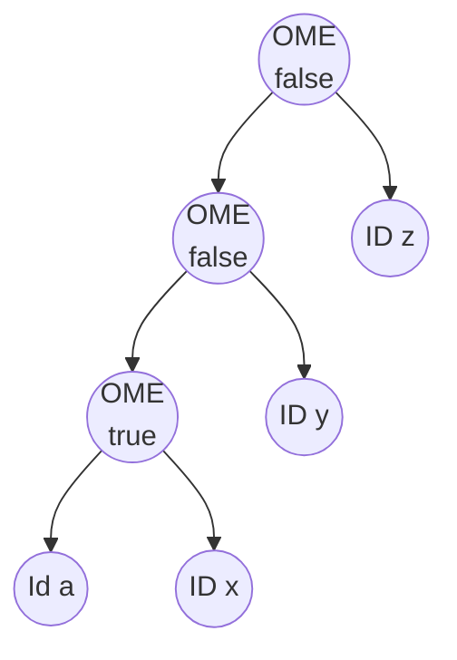

# Reproducing Nicolo Ribaudo  "@babel/how-to" talk at  HolyJS 2019

This chapter contains my attempt to reproduce and learn from[ Nicolo Ribaudo's talk at HolyJS 2019](https://youtu.be/UeVq_U5obnE?si=Vl_A49__5zgITvjx). 

There are several branches in this repository that correspond to the different stages of the talk. The branches are named after the time in the video where Nicolo is explaining code similar to those that you can find in the files 

- `/src/nicolo-howto-talk/optionalchaining-plugin.cjs` and 
- `/src/nicolo-howto-talk/optionalchaining-plugin2.cjs` 
- `/src/nicolo-howto-talk/input-*.js`
- `/src/nicolo-howto-talk/loose.config.js`
  
is shown. For example, the branch `40m24s` corresponds to the code shown at minute 40:24 of the video:

```sh
nicolo-howto-talk git:(40m24s) git -P branch
  29m47s  # template.expression.ast
  31m14s  # The undefined problem
  31m31s
  34m08s
* 40m24s
  main
```

## Optional Chaining Proposal obj?.prop

The target is to build a Babel plugin that transforms the optional chaining proposal `obj?.prop` (now a part of the JavaScript language) into a sequence of tests and assignments that check if the object and its properties are defined.

See folder
[src/nicolo-howto-talk/production-example](/src/nicolo-howto-talk/production-example/)
and the file
[/src/nicolo-howto-talk/production-example/README.md](/src/nicolo-howto-talk/production-example/README.md) for an input example and the output using the current production plugin (2024).

[Nicolo starts using an editor](https://youtu.be/UeVq_U5obnE?si=Vl_A49__5zgITvjx) that resembles https://astexplorer.net, but it is not clear which one he is using. I will initially go with the [AST Explorer](https://astexplorer.net/) and later with VSCode (see folder [/src/nicolo-howto-talk](/src/nicolo-howto-talk)).

## manipulateOptions: sending options to the parser

In the returned object it introduces the [manipulateOptions](/doc/nicolo-howto-talk/manipulate-options.md) method that is used to modify the behavior of the parser. A plugin could manipulate the parser options using  `manipulateOptions(opts, parserOpts)` and adding plugins to `parserOpts.plugins`. Unfortunately, parser plugins are not real plugins: [they are just a way to enable syntax features already implemented in the Babel parser](/doc/parser/optional-chaining-in-the-parser.md). It is almost impossible to
create a JavaScript parser that adheres to the Open-Closed Principle.

At [26:44](https://youtu.be/UeVq_U5obnE) Nicolo has this preliminary code for the plugin:

```js
module.exports = function myPlugin({types: t, template}, options) {
  return {
    name: "optional-chaining-plugin",
    manipulateOptions(opts) {
      opts.parserOpts.plugins.push("OptionalChaining")
    },
    visitor: {
      OptionalMemberExpression(path) {
      } 
    }
  }
}
```

At this point we need to review the properties of an `OptionalMemberExpression` node: `object`, `property`, `computed` and  `optional`.

## Differences between Babel and Espree ASTs with Optional Chaining

See section [optional-property.md](/doc/nicolo-howto-talk/optional-property.md) for a Explanation of the `optional` Property in an `OptionalMemberExpression` node in a Babel AST. In section [optional-chain.md](/doc/nicolo-howto-talk/optional-chain.md) we compare the Babel and Espree ASTs for `obj?.foo.bar`.

## template.expression.ast 

At minute [29:40](https://youtu.be/UeVq_U5obnE?t=1775) he has filled the `OptionalMemberExpression` visitor with the following code:


```js
module.exports = function myPlugin({types: t, template}, options) {
  return {
    name: "optional-chaining-plugin",
    manipulateOptions(opts) {
      opts.parserOpts.plugins.push("OptionalChaining")
    },
    visitor: {
      OptionalMemberExpression(path) {
        let { object, property} = path.node;
        let memberExp = t.memberExpression(object, property);
        path.replaceWith(
          template.expression.ast`${object} == null? undefined : ${memberExp}`
        )
      } 
    }
  }
}
```
that for an input like `obj?.foo` will produce the output:

```js
obj == null ? undefined : obj.foo;
```

The `template.expression`, `template.statements`, are variants of the 
[`template` function](https://babeljs.io/docs/babel-template). 
By default `@babel/template` returns a function which is invoked with an optional object of replacements, but when using `.ast` as in this example, the AST is returned directly.

**Notice that you write the code but are interpolating the `object` and `memberExp` variables which contain 
ASTs using ordinary JS backquotes!** 


## The `undefined` problem

> ... But the code 
> ```js
> template.expression.ast`${object} == null? undefined : ${memberExp}`
> ``` 
> it has a few problems. Someone could write this in their code:
>

`➜  nicolo-howto-talk git:(main) ✗ cat redefine-undefined.cjs`
```js
var undefined = 42;
console.log(undefined); // 42                                                                                                                     
➜  nicolo-howto-talk git:(main) ✗ node redefine-undefined.cjs 
42
```

We have to cope with this kind of bad code and have access to the original `undefined`.
The expression [void 0](/doc/nicolo-howto-talk/void.md) always returns `undefined` and we are going to use it instead. 
Let us switch from [astexplorer](https://astexplorer.net/#/gist/e48001e11fe9ad94b5e90a24bb4c4340/b51a7d45d97647ea9580c04de28dc08583806aa4) to VSCode:

`➜  nicolo-howto-talk git:(main) cat `[input.js](/src/nicolo-howto-talk/input.js)
```js
a?.b
```
`➜  nicolo-howto-talk git:(main) cat babel.config.json`
```json
{
  "plugins": [
    "./optionalchaining-plugin.cjs"
  ]
}
```

At minute [29:47](https://youtu.be/UeVq_U5obnE?t=1785) Nicolo uses `path.scope.buildUndefined()`to produce `void 0` to ensure that `undefined` is `undefined`:


`➜  nicolo-howto-talk git:(main) cat `[optionalchaining-plugin.cjs](/src/nicolo-howto-talk/optionalchaining-plugin.cjs)
```js
module.exports = function myPlugin(babel, options) {
  const {types: t, template } = babel;
  return {
    name: "optional-chaining-plugin",
    manipulateOptions(opts) {
      opts.parserOpts.plugins.push("OptionalChaining")
    },
    visitor: {
      OptionalMemberExpression(path) {
        let { object, property} = path.node;
        let memberExp = t.memberExpression(object, property);
        let undef = path.scope.buildUndefinedNode(); // Create a "void 0" nodes
        path.replaceWith(
          template.expression.ast`
             ${object} == null? ${undef} : // Use the "void 0" node
             ${memberExp}
          `
        )
      } 
    }
  }
}
```

Execution:

`➜  babel-learning git:(29m47s) npx babel src/nicolo-howto-talk/input.js --plugins=./src/nicolo-howto-talk/optionalchaining-plugin.cjs`
```js
"use strict";

a == null ? void 0 : a.b;
```

## Computed properties 

At minute [31.14](https://youtu.be/UeVq_U5obnE?t=1867) Nicolo considers the more general case of accessing a computed property like in:

`➜  nicolo-howto-talk git:(main) ✗ cat input-array.js`
```js 
a?.[0]
```
When we feed this input to the plugin we get the output:

```
➜  nicolo-howto-talk git:(main) ✗ npx babel input-array.js
TypeError: /Users/casianorodriguezleon/campus-virtual/2324/learning/babel-learning/src/nicolo-howto-talk/input-array.js:
Property property of MemberExpression expected node to be 
of a type ["Identifier","PrivateName"] but instead got "NumericLiteral"
```
This is because the `property` of the `OptionalMemberExpression` is in this case a `NumericLiteral`:

`➜  nicolo-howto-talk git:(main) compast -blp 'a?.[0]' | yq '.program.body[0]'`
```json 
{
  "type": "ExpressionStatement",
  "expression": {
    "type": "OptionalMemberExpression",
    "object": {
      "type": "Identifier",
      "name": "a"
    },
    "computed": true,
    "property": {
      "type": "NumericLiteral",
      "extra": {
        "rawValue": 0,
        "raw": "0"
      },
      "value": 0
    },
    "optional": true
  }
}
```
The error is caused due to the fact that by default value for `MemberExpression`s the `computed` property is `false`
and since in the previous code we haven't specified it, it is assumed to be `false`. The consequence being that the `property` 
is expected to be an `Identifier` or a [PrivateName](privatename.md) and not a `NumericLiteral`. 

To avoid the error we take the `computed` property of the node and pass it to the `t.memberExpression` we build
for the replacement:

`➜  babel-learning git:(main) ✗ cat src/nicolo-howto-talk/optionalchaining-plugin.cjs`
```js
//const generate = require('@babel/generator').default;
module.exports = function myPlugin(babel, options) {
  const {types: t, template } = babel;
  return {
    name: "optional-chaining-plugin",
    manipulateOptions(opts) {
      opts.parserOpts.plugins.push("OptionalChaining")
    },
    visitor: {
      OptionalMemberExpression(path) {
        let { object, property, computed} = path.node; // <= computed is defined from the node
        let memberExp = t.memberExpression(object, property, computed);
        let undef = path.scope.buildUndefinedNode();
        path.replaceWith(
          template.expression.ast`
             ${object} == null? ${undef} :
             ${memberExp}
          `
        )
      } 
    }
  }
}
```
Now the plugin works for both cases `a?.b` and `a?.[0]`:

`➜  babel-learning git:(31m14s) npx babel src/nicolo-howto-talk/input-array.js --plugins=./src/nicolo-howto-talk/optionalchaining-plugin.cjs
`
```js
"use strict";

a == null ? void 0 : a[0];
```

## What if the object part is a call expression or a `get`?

At minute [31:31](https://youtu.be/UeVq_U5obnE?t=1887) Nicolo considers the case of the object part being a call expression like `a()?.x`.

> ... As you can see there is a problem, while in the input code`a()` is called once, in the output code it is called twice. Once to check if it is `null` and once to access the property. We can avoid it by storing the result of the call in a variable and then using the variable in the `alternate` part of the `conditional` expression.

> To do that Babel provides the `path.scope.generateUidIdentifier` method that generates a unique identifier that can be used to store the result of the call expression. To declare that variable we use the `path.scope.push` method.


The `path.scope.push` method in Babel.js is used to add a new binding (variable) to the current scope. This method is part of the Babel API for manipulating the Abstract Syntax Tree (AST) and is particularly useful when you are developing Babel plugins or transforms and need to introduce new variables into the code. 

`➜  babel-learning git:(main) ✗ cat src/nicolo-howto-talk/optionalchaining-plugin.cjs`
```js
module.exports = function myPlugin(babel, options) {
  const {types: t, template } = babel;
  return {
    name: "optional-chaining-plugin",
    manipulateOptions(opts) {
      opts.parserOpts.plugins.push("OptionalChaining")
    },
    visitor: {
      OptionalMemberExpression(path) {
        let { object, property, computed} = path.node;
        let tmp = path.scope.generateUidIdentifier('_obj'); // <= Generate a unique identifier
        path.scope.push({id: tmp, kind: "let", init: t.nullLiteral()}); // <= Add the new variable to the scope
        let memberExp = t.memberExpression(tmp, property, computed); // <= Use the new variable as Substitute for the object to avoid calling it twice
        let undef = path.scope.buildUndefinedNode(); // Safe undefined
        path.replaceWith(
          template.expression.ast`
             ${tmp} = ${object} == null? ${undef} :
             ${memberExp}
          `
        )
      } 
    }
  }
}
```

Now the plugin works for the case `a()?.x` (see the input file at [src/nicolohowto-talk/input-function-object.js](/src/nicolo-howto-talk/input-function-object.js)):

`➜  babel-learning git:(31m31s) npx babel src/nicolo-howto-talk/input-function-object.js --plugins=./src/nicolo-howto-talk/optionalchaining-plugin.cjs `
```js
"use strict";

let _obj = null;
_obj = a() == null ? void 0 : _obj.x;
```

## Larger Chainings with more than one dot

At minute [34:08](https://youtu.be/UeVq_U5obnE?t=2052) Nicolo considers 

> But what if we have more than one nested property? 

This is the case of a larger chain of optional properties like `a?.x.y.z` whose Babel AST is like follows:

`➜  babel-learning git:(34m08s) ✗ compast -blp 'a?.x.y.z' | yq '.program.body[0].expression'`
```json 
{
  "type": "OptionalMemberExpression",
  "object": {
    "type": "OptionalMemberExpression",
    "object": {
      "type": "OptionalMemberExpression",
      "object": {
        "type": "Identifier",
        "name": "a"
      },
      "computed": false,
      "property": {
        "type": "Identifier",
        "name": "x"
      },
      "optional": true
    },
    "computed": false,
    "property": {
      "type": "Identifier",
      "name": "y"
    },
    "optional": false
  },
  "computed": false,
  "property": {
    "type": "Identifier",
    "name": "z"
  },
  "optional": false
}
```

The chaining `a?.x.y.z` is actually interpreted as `((a?.x).y).z)`.  

We can see that not only the inner `a?.x` is 
an `OptionalMemberExpression` but also 
the outer node of  `(a?.x).y` is an `OptionalMemberExpression`. 

The difference is that the `optional` property of the `a?.x` is `true` and the `optional` property of the `(a?.x).y` is `false`. 
In the same way the `a?.x.y.z` is an `OptionalMemberExpression` but the `optional` property is `false`. 

If we change the last dot to `a?.x.y?.z` then the outer node of `(a?.x.y)?.z` 
is an `OptionalMemberExpression` with `optional` property set to `true`.

Here is again the AST depicted as a graph. `OME` stands for `OptionalMemberExpression` and we use `true` and `false` to indicate the `optional` property of the nodes:



> We are checking if `a` is **nullish**. If it is not `nullish` we wanto to get `x.y.z`. We are not checking if those things are nullish.  Otherwise we have had other question marks like this `a?.x?.y.z`.
>
> We are currently visiting this starting from the outermost  node to the innermost nodes but we 
> should only check transform (the nodes)  where  the `optional` property is `true`.
> So we can go down in the AST until we found the "real" `optional` property.


Here is a solution slightly different from the one Nicolo proposes:

`➜  babel-learning git:(main) ✗ cat src/nicolo-howto-talk/optionalchaining-plugin.cjs`
```js 
module.exports = function myPlugin(babel, options) {
  const { types: t, template } = babel;
  return {
    name: "optional-chaining-plugin",
    manipulateOptions(opts) {
      opts.parserOpts.plugins.push("OptionalChaining")
    },
    visitor: {
      OptionalMemberExpression(path) {

        while (!path.node.optional) path = path.get("object"); // <= Go down in the AST until we find the "real" optional property

        let { object, property, computed } = path.node;
        let tmp = path.scope.generateUidIdentifierBasedOnNode(property);  // <= Generate a unique identifier based on the property
        path.scope.push({ id: tmp, kind: 'let', init: t.NullLiteral() }); // <= Add the new variable to the scope

        
        let memberExp = t.memberExpression(tmp, property, computed);
        let undef = path.scope.buildUndefinedNode();
        path.replaceWith( // <= Replace the node with the new code
          template.expression.ast`
             (${tmp} = ${object}) == null? ${undef} :
             ${memberExp}
          `
        )

      }
    }
  }
}
```

Let us consider the following input:

`➜  babel-learning git:(main) cat src/nicolo-howto-talk/input-multiple.js`
```js
let a = {x: {y: {z: 1}}};
console.log(a?.x.y?.z)
console.log(a?.x.w?.z)
console.log(a?.x.y.z)
```

when we run the plugin we get the following output:


`➜  babel-learning git:(main) npx babel src/nicolo-howto-talk/input-multiple.js --plugins=./src/nicolo-howto-talk/optionalchaining-plugin.cjs`
```js
"use strict";

let _z = null, _x = null, _z2 = null, _x2 = null, _x3 = null;
let a = { x: { y: { z: 1 } } };
console.log((_z = ((_x = a) == null ? void 0 : _x.x).y) == null ? void 0 : _z.z);
console.log((_z2 = ((_x2 = a) == null ? void 0 : _x2.x).w) == null ? void 0 : _z2.z);
console.log(((_x3 = a) == null ? void 0 : _x3.x).y.z);
```

Let us consider the first expression `a?.x.y?.z`. We can analyze the translation of `((a?.x).y)?.z`:

1. `(_x = a) == null ? void 0 : _x.x)` is the transformation of `a?.x`. Notice the introduction of the `_x` variable.
2. `(_z = ((_x = a) == null ? void 0 : _x.x).y)` is the transformation of `a?.x.y`. Notice the introduction of the `_z` variable
3. `console.log((_z = ((_x = a) == null ? void 0 : _x.x).y) == null ? void 0 : _z.z);` is the transformation of `a?.x.y?.z`.

If we pipe the output to `node` we get:

```
➜  babel-learning git:(main) npx babel src/nicolo-howto-talk/input-multiple.js --plugins=./src/nicolo-howto-talk/optionalchaining-plugin.cjs | node
1
undefined
1
```

You can also check it against the example [src/nicolo-howto-talk/input-array.js](/src/nicolo-howto-talk/input-array.js)

`➜  babel-learning git:(main) cat src/nicolo-howto-talk/input-array.js`
```js          
const a = [[2,3]];
console.log(a?.[0][1]);
console.log(a?.[0]?.[2]);
console.log(a?.[0][1]?.[0]);
```

`➜  babel-learning git:(main) npx babel src/nicolo-howto-talk/input-array.js --plugins=./src/nicolo-howto-talk/optionalchaining-plugin.cjs`
```js
"use strict";

let _ = null, _2 = null, _3 = null, _4 = null, _5 = null;
const a = [[2, 3]];
console.log(((_ = a) == null ? void 0 : _[0])[1]);
console.log((_2 = (_3 = a) == null ? void 0 : _3[0]) == null ? void 0 : _2[2]);
console.log((_4 = ((_5 = a) == null ? void 0 : _5[0])[1]) == null ? void 0 : _4[0]);
```

When we run it with `node` we get:
```
➜  babel-learning git:(main) npx babel src/nicolo-howto-talk/input-array.js --plugins=./src/nicolo-howto-talk/optionalchaining-plugin.cjs | node 
3
undefined
undefined
```

The traversing for the first true `optional` property can be removed if we visit the `OptionalMemberExpression` nodes 
in `exit` order instead of `enter` order. See the solution at [/src/nicolo-howto-talk/optionalchaining-plugin2.cjs](/src/nicolo-howto-talk/optionalchaining-plugin2.cjs):

`➜  nicolo-howto-talk git:(main) ✗ cat optionalchaining-plugin2.cjs`
```js
module.exports = function myPlugin(babel, options) {
  const { types: t, template } = babel;
  return {
    name: "optional-chaining-plugin",
    manipulateOptions(opts) {
      opts.parserOpts.plugins.push("OptionalChaining")
    },
    visitor: {
      OptionalMemberExpression: {
        exit(path) { // <= Now we substitute the "while (!path.node.optional) ..." with a simple return   
          if (!path.node?.optional) return;
          let { object, property, computed } = path.node;

          let tmp = path.scope.generateUidIdentifierBasedOnNode(property);

          path.scope.push({ id: tmp, kind: 'let', init: t.NullLiteral() });

          let memberExp = t.memberExpression(tmp, property, computed);
          let undef = path.scope.buildUndefinedNode();
          path.replaceWith(
            template.expression.ast`
             (${tmp} = ${object}) == null? ${undef} :
             ${memberExp}
          `
          )
        }
      }
    }
  }
}
```

## Loose mode

At minute [40:24](https://youtu.be/UeVq_U5obnE?t=2418) Nicolo introduces `loose` mode. 
Babel.js "loose mode" is an option that you can enable for certain plugins and presets to generate code that is simpler and potentially more performant but may not strictly adhere to the ECMAScript specification in all edge cases. This mode typically results in output that is closer to how developers might write code manually and can be more efficient in terms of performance and code size.

There are multiple reasons why we want to use "Loose Mode":

1. **Performance**: Loose mode often generates code that executes faster.
2. **Size**: The output code is usually smaller, which can be beneficial for reducing bundle sizes in web applications.
3. **Simplicity**: The generated code is often simpler and easier to understand.

But we have to be aware of the following drawbacks:

1. **Spec Compliance**: The generated code might not fully adhere to the ECMAScript specification, especially in less common edge cases.
2. **Compatibility**: While the generated code works in most cases, there might be subtle differences in behavior compared to the spec-compliant version, which can lead to bugs if not carefully considered.

We can enable loose mode by setting the `loose` option to `true` in the configuration for specific plugins or presets. Review section [Passing plugin options to the visitor methods](/doc/plugin-options.md#passing-plugin-options-to-the-visitor-methods). 
In a Babel plugin, the visitor receives a second parameter after the `path` parameter which is usually known as the  `state` parameter. This `state` object that holds any kind of data that the plugin might need to maintain state across the visit. Namely, the property `state.opts` contains the options passed to the plugin via the configuration file. We create the following
configuration file:

`➜  nicolo-howto-talk git:(40m24s) cat loose.config.js`
```js 
const path = require('path');
module.exports = {
  plugins: [
    [ path.join(__dirname, 'optionalchaining-plugin2.cjs'), { loose: true} ],
  ]
}
```

## References

* Watch the talk in Youtube: https://youtu.be/UeVq_U5obnE?si=Vl_A49__5zgITvjx
  * [22:07/59:40 Case Study: Optional Chaining Proposal](https://youtu.be/UeVq_U5obnE?t=1325)
* See the associated repo at GitHub: https://github.com/nicolo-ribaudo/conf-holyjs-moscow-2019, 
* [Nicolo slides](/pdfs/holyjs-2019-Nicolo_Ribaudo_babelhow-to.pdf)
* [The plugin babel-plugin-transform-optional-chaining](https://github.com/babel/babel/tree/main/packages/babel-plugin-transform-optional-chaining) at GitHub Babel repo and [the way it is used](https://babeljs.io/docs/babel-plugin-transform-optional-chaining)
* Web site of the HolyJS 2019 conference: https://holyjs.ru/en/archive/2019%20Moscow/


