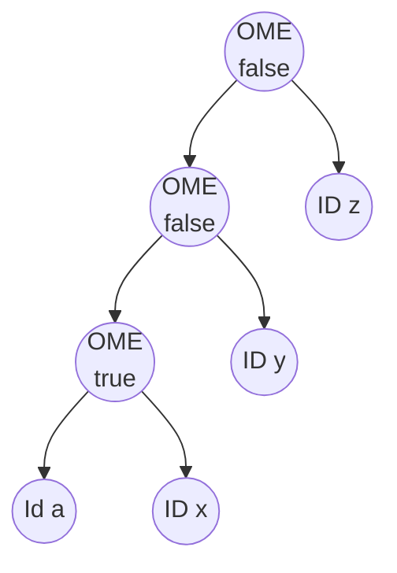

# Reproducing Nicolo Ribaudo  "@babel/how-to" talk at  HolyJS 2019

This chapter contains my attempt to reproduce and learn from[ Nicolo Ribaudo's talk at HolyJS 2019](https://youtu.be/UeVq_U5obnE?si=Vl_A49__5zgITvjx). 

There are several branches in this repository that correspond to the different stages of the talk. The branches are named after the time in the video where Nicolo is explaining code leading to something similar to those that you can find in the files 

- `/src/nicolo-howto-talk/optionalchaining-plugin.cjs` and 
- `/src/nicolo-howto-talk/optionalchaining-plugin2.cjs` 
- `/src/nicolo-howto-talk/input-*.js`
- `/src/nicolo-howto-talk/loose.config.js`
  
For example, the branch `40m24s` corresponds to the code shown starting at minute 40:24 of the video and corresponds o the section
[Loose mode](/doc/nicolo-howto-talk/README.md#loose-mode).

```sh
nicolo-howto-talk git:(40m24s) git -P branch
  29m47s  # template.expression.ast
  31m14s  # The undefined problem
  31m31s
  34m08s
* 40m24s
  main
```

## Optional Chaining Proposal obj?.prop

The target is to build a Babel plugin that transforms the optional chaining proposal `obj?.prop` (now a part of the JavaScript language) into a sequence of tests and assignments that check if the object and its properties are defined.

See folder
[src/nicolo-howto-talk/production-example](/src/nicolo-howto-talk/production-example/)
and the file
[/src/nicolo-howto-talk/production-example/README.md](/src/nicolo-howto-talk/production-example/README.md) for an input example and the output using the current production plugin (2024).

[Nicolo starts using an editor](https://youtu.be/UeVq_U5obnE?si=Vl_A49__5zgITvjx) that resembles https://astexplorer.net, but it is not clear which one he is using. I will initially go with the [AST Explorer](https://astexplorer.net/) and later with VSCode (see folder [/src/nicolo-howto-talk](/src/nicolo-howto-talk)).

## manipulateOptions: sending options to the parser

In the returned object it introduces the [manipulateOptions](/doc/nicolo-howto-talk/manipulate-options.md) method that is used to modify the behavior of the parser. A plugin could manipulate the parser options using  `manipulateOptions(opts, parserOpts)` and adding plugins to `parserOpts.plugins`. Unfortunately, parser plugins are not real plugins: [they are just a way to enable syntax features already implemented in the Babel parser](/doc/parser/optional-chaining-in-the-parser.md). It is almost impossible to
create a JavaScript parser that adheres to the Open-Closed Principle.

At [26:44](https://youtu.be/UeVq_U5obnE) Nicolo has this preliminary code for the plugin:

```js
module.exports = function myPlugin({types: t, template}, options) {
  return {
    name: "optional-chaining-plugin",
    manipulateOptions(opts) {
      opts.parserOpts.plugins.push("OptionalChaining")
    },
    visitor: {
      OptionalMemberExpression(path) {
      } 
    }
  }
}
```

At this point we need to review the properties of an `OptionalMemberExpression` node: `object`, `property`, `computed` and  `optional`.

## Differences between Babel and Espree ASTs with Optional Chaining

See section [optional-property.md](/doc/nicolo-howto-talk/optional-property.md) for a Explanation of the `optional` Property in an `OptionalMemberExpression` node in a Babel AST. In section [optional-chain.md](/doc/nicolo-howto-talk/optional-chain.md) we compare the Babel and Espree ASTs for `obj?.foo.bar`.

## template.expression.ast 

At minute [29:40](https://youtu.be/UeVq_U5obnE?t=1775) he has filled the `OptionalMemberExpression` visitor with the following code:


```js
module.exports = function myPlugin({types: t, template}, options) {
  return {
    name: "optional-chaining-plugin",
    manipulateOptions(opts) {
      opts.parserOpts.plugins.push("OptionalChaining")
    },
    visitor: {
      OptionalMemberExpression(path) {
        let { object, property} = path.node;
        let memberExp = t.memberExpression(object, property);
        path.replaceWith(
          template.expression.ast`${object} == null? undefined : ${memberExp}`
        )
      } 
    }
  }
}
```
that for an input like `obj?.foo` will produce the output:

```js
obj == null ? undefined : obj.foo;
```

The `template.expression`, `template.statements`, are variants of the 
[`template` function](https://babeljs.io/docs/babel-template). 
By default `@babel/template` returns a function which is invoked with an optional object of replacements, but when using `.ast` as in this example, the AST is returned directly.

**Notice that you write the code but are interpolating the `object` and `memberExp` variables which contain 
ASTs using ordinary JS backquotes!** 


## The `undefined` problem

> ... But the code 
> ```js
> template.expression.ast`${object} == null? undefined : ${memberExp}`
> ``` 
> it has a few problems. Someone could write this in their code:
>

`➜  nicolo-howto-talk git:(main) ✗ cat redefine-undefined.cjs`
```js
var undefined = 42;
console.log(undefined); // 42                                                                                                                     
➜  nicolo-howto-talk git:(main) ✗ node redefine-undefined.cjs 
42
```

We have to cope with this kind of bad code and have access to the original `undefined`.
The expression [void 0](/doc/nicolo-howto-talk/void.md) always returns `undefined` and we are going to use it instead. 
Let us switch from [astexplorer](https://astexplorer.net/#/gist/e48001e11fe9ad94b5e90a24bb4c4340/b51a7d45d97647ea9580c04de28dc08583806aa4) to VSCode:

`➜  nicolo-howto-talk git:(main) cat `[input.js](/src/nicolo-howto-talk/input.js)
```js
a?.b
```
`➜  nicolo-howto-talk git:(main) cat babel.config.json`
```json
{
  "plugins": [
    "./optionalchaining-plugin.cjs"
  ]
}
```

At minute [29:47](https://youtu.be/UeVq_U5obnE?t=1785) Nicolo uses `path.scope.buildUndefined()`to produce `void 0` to ensure that `undefined` is `undefined`:


`➜  nicolo-howto-talk git:(main) cat `[optionalchaining-plugin.cjs](/src/nicolo-howto-talk/optionalchaining-plugin.cjs)
```js
module.exports = function myPlugin(babel, options) {
  const {types: t, template } = babel;
  return {
    name: "optional-chaining-plugin",
    manipulateOptions(opts) {
      opts.parserOpts.plugins.push("OptionalChaining")
    },
    visitor: {
      OptionalMemberExpression(path) {
        let { object, property} = path.node;
        let memberExp = t.memberExpression(object, property);
        let undef = path.scope.buildUndefinedNode(); // Create a "void 0" nodes
        path.replaceWith(
          template.expression.ast`
             ${object} == null? ${undef} : // Use the "void 0" node
             ${memberExp}
          `
        )
      } 
    }
  }
}
```

Execution:

`➜  babel-learning git:(29m47s) npx babel src/nicolo-howto-talk/input.js --plugins=./src/nicolo-howto-talk/optionalchaining-plugin.cjs`
```js
"use strict";

a == null ? void 0 : a.b;
```

## Computed properties 

At minute [31.14](https://youtu.be/UeVq_U5obnE?t=1867) Nicolo considers the more general case of accessing a computed property like in:

`➜  nicolo-howto-talk git:(main) ✗ cat input-array.js`
```js 
a?.[0]
```
When we feed this input to the plugin we get the output:

```
➜  nicolo-howto-talk git:(main) ✗ npx babel input-array.js
TypeError: /Users/casianorodriguezleon/campus-virtual/2324/learning/babel-learning/src/nicolo-howto-talk/input-array.js:
Property property of MemberExpression expected node to be 
of a type ["Identifier","PrivateName"] but instead got "NumericLiteral"
```
This is because the `property` of the `OptionalMemberExpression` is in this case a `NumericLiteral`:

`➜  nicolo-howto-talk git:(main) compast -blp 'a?.[0]' | yq '.program.body[0]'`
```json 
{
  "type": "ExpressionStatement",
  "expression": {
    "type": "OptionalMemberExpression",
    "object": {
      "type": "Identifier",
      "name": "a"
    },
    "computed": true,
    "property": {
      "type": "NumericLiteral",
      "extra": {
        "rawValue": 0,
        "raw": "0"
      },
      "value": 0
    },
    "optional": true
  }
}
```
The error is caused due to the fact that by default value for `MemberExpression`s the `computed` property is `false`
and since in the previous code we haven't specified it, it is assumed to be `false`. The consequence being that the `property` 
is expected to be an `Identifier` or a [PrivateName](privatename.md) and not a `NumericLiteral`. 

To avoid the error we take the `computed` property of the node and pass it to the `t.memberExpression` we build
for the replacement:

`➜  babel-learning git:(main) ✗ cat src/nicolo-howto-talk/optionalchaining-plugin.cjs`
```js
//const generate = require('@babel/generator').default;
module.exports = function myPlugin(babel, options) {
  const {types: t, template } = babel;
  return {
    name: "optional-chaining-plugin",
    manipulateOptions(opts) {
      opts.parserOpts.plugins.push("OptionalChaining")
    },
    visitor: {
      OptionalMemberExpression(path) {
        let { object, property, computed} = path.node; // <= computed is defined from the node
        let memberExp = t.memberExpression(object, property, computed);
        let undef = path.scope.buildUndefinedNode();
        path.replaceWith(
          template.expression.ast`
             ${object} == null? ${undef} :
             ${memberExp}
          `
        )
      } 
    }
  }
}
```
Now the plugin works for both cases `a?.b` and `a?.[0]`:

`➜  babel-learning git:(31m14s) npx babel src/nicolo-howto-talk/input-array.js --plugins=./src/nicolo-howto-talk/optionalchaining-plugin.cjs
`
```js
"use strict";

a == null ? void 0 : a[0];
```

## What if the object part is a call expression or a `get`?

At minute [31:31](https://youtu.be/UeVq_U5obnE?t=1887) Nicolo considers the case of the object part being a call expression like `a()?.x`.

> ... As you can see there is a problem, while in the input code`a()` is called once, in the output code it is called twice. Once to check if it is `null` and once to access the property. We can avoid it by storing the result of the call in a variable and then using the variable in the `alternate` part of the `conditional` expression.

> To do that Babel provides the `path.scope.generateUidIdentifier` method that generates a unique identifier that can be used to store the result of the call expression. To declare that variable we use the `path.scope.push` method.


The `path.scope.push` method in Babel.js is used to add a new binding (variable) to the current scope. This method is part of the Babel API for manipulating the Abstract Syntax Tree (AST) and is particularly useful when you are developing Babel plugins or transforms and need to introduce new variables into the code. 

`➜  babel-learning git:(main) ✗ cat src/nicolo-howto-talk/optionalchaining-plugin.cjs`
```js
module.exports = function myPlugin(babel, options) {
  const {types: t, template } = babel;
  return {
    name: "optional-chaining-plugin",
    manipulateOptions(opts) {
      opts.parserOpts.plugins.push("OptionalChaining")
    },
    visitor: {
      OptionalMemberExpression(path) {
        let { object, property, computed} = path.node;
        let tmp = path.scope.generateUidIdentifier('_obj'); // <= Generate a unique identifier
        path.scope.push({id: tmp, kind: "let", init: t.nullLiteral()}); // <= Add the new variable to the scope
        let memberExp = t.memberExpression(tmp, property, computed); // <= Use the new variable as Substitute for the object to avoid calling it twice
        let undef = path.scope.buildUndefinedNode(); // Safe undefined
        path.replaceWith(
          template.expression.ast`
             ${tmp} = ${object} == null? ${undef} :
             ${memberExp}
          `
        )
      } 
    }
  }
}
```

Now the plugin works for the case `a()?.x` (see the input file at [src/nicolohowto-talk/input-function-object.js](/src/nicolo-howto-talk/input-function-object.js)):

`➜  babel-learning git:(31m31s) npx babel src/nicolo-howto-talk/input-function-object.js --plugins=./src/nicolo-howto-talk/optionalchaining-plugin.cjs `
```js
"use strict";

let _obj = null;
_obj = a() == null ? void 0 : _obj.x;
```

## Larger Chainings with more than one dot

At minute [34:08](https://youtu.be/UeVq_U5obnE?t=2052) Nicolo considers 

> But what if we have more than one nested property? 

This is the case of a larger chain of optional properties like `a?.x.y.z` whose Babel AST is like follows:

`➜  babel-learning git:(34m08s) ✗ compast -blp 'a?.x.y.z' | yq '.program.body[0].expression'`
```json 
{
  "type": "OptionalMemberExpression",
  "object": {
    "type": "OptionalMemberExpression",
    "object": {
      "type": "OptionalMemberExpression",
      "object": {
        "type": "Identifier",
        "name": "a"
      },
      "computed": false,
      "property": {
        "type": "Identifier",
        "name": "x"
      },
      "optional": true
    },
    "computed": false,
    "property": {
      "type": "Identifier",
      "name": "y"
    },
    "optional": false
  },
  "computed": false,
  "property": {
    "type": "Identifier",
    "name": "z"
  },
  "optional": false
}
```

The chaining `a?.x.y.z` is actually interpreted as `((a?.x).y).z)`.  

We can see that not only the inner `a?.x` is 
an `OptionalMemberExpression` but also 
the outer node of  `(a?.x).y` is an `OptionalMemberExpression`. 

The difference is that the `optional` property of the `a?.x` is `true` and the `optional` property of the `(a?.x).y` is `false`. 
In the same way the `a?.x.y.z` is an `OptionalMemberExpression` but the `optional` property is `false`. 

If we change the last dot to `a?.x.y?.z` then the outer node of `(a?.x.y)?.z` 
is an `OptionalMemberExpression` with `optional` property set to `true`.

Here is again the AST depicted as a graph. `OME` stands for `OptionalMemberExpression` and we use `true` and `false` to indicate the `optional` property of the nodes:



> We are checking if `a` is **nullish**. If it is not `nullish` we wanto to get `x.y.z`. We are not checking if those things are nullish.  Otherwise we have had other question marks like this `a?.x?.y.z`.
>
> We are currently visiting this starting from the outermost  node to the innermost nodes but we 
> should only check transform (the nodes)  where  the `optional` property is `true`.
> So we can go down in the AST until we found the "real" `optional` property.


Here is a solution slightly different from the one Nicolo proposes:

`➜  babel-learning git:(main) ✗ cat src/nicolo-howto-talk/optionalchaining-plugin.cjs`
```js 
module.exports = function myPlugin(babel, options) {
  const { types: t, template } = babel;
  return {
    name: "optional-chaining-plugin",
    manipulateOptions(opts) {
      opts.parserOpts.plugins.push("OptionalChaining")
    },
    visitor: {
      OptionalMemberExpression(path) {

        while (!path.node.optional) path = path.get("object"); // <= Go down in the AST until we find the "real" optional property

        let { object, property, computed } = path.node;
        let tmp = path.scope.generateUidIdentifierBasedOnNode(property);  // <= Generate a unique identifier based on the property
        path.scope.push({ id: tmp, kind: 'let', init: t.NullLiteral() }); // <= Add the new variable to the scope

        
        let memberExp = t.memberExpression(tmp, property, computed);
        let undef = path.scope.buildUndefinedNode();
        path.replaceWith( // <= Replace the node with the new code
          template.expression.ast`
             (${tmp} = ${object}) == null? ${undef} :
             ${memberExp}
          `
        )

      }
    }
  }
}
```

Let us consider the following input:

`➜  babel-learning git:(main) cat src/nicolo-howto-talk/input-multiple.js`
```js
let a = {x: {y: {z: 1}}};
console.log(a?.x.y?.z)
console.log(a?.x.w?.z)
console.log(a?.x.y.z)
```

when we run the plugin we get the following output:


`➜  babel-learning git:(main) npx babel src/nicolo-howto-talk/input-multiple.js --plugins=./src/nicolo-howto-talk/optionalchaining-plugin.cjs`
```js
"use strict";

let _z = null, _x = null, _z2 = null, _x2 = null, _x3 = null;
let a = { x: { y: { z: 1 } } };
console.log((_z = ((_x = a) == null ? void 0 : _x.x).y) == null ? void 0 : _z.z);
console.log((_z2 = ((_x2 = a) == null ? void 0 : _x2.x).w) == null ? void 0 : _z2.z);
console.log(((_x3 = a) == null ? void 0 : _x3.x).y.z);
```

Let us consider the first expression `a?.x.y?.z`. We can analyze the translation of `((a?.x).y)?.z`:

1. `(_x = a) == null ? void 0 : _x.x)` is the transformation of `a?.x`. Notice the introduction of the `_x` variable.
2. `(_z = ((_x = a) == null ? void 0 : _x.x).y)` is the transformation of `a?.x.y`. Notice the introduction of the `_z` variable
3. `console.log((_z = ((_x = a) == null ? void 0 : _x.x).y) == null ? void 0 : _z.z);` is the transformation of `a?.x.y?.z`.

If we pipe the output to `node` we get:

```
➜  babel-learning git:(main) npx babel src/nicolo-howto-talk/input-multiple.js --plugins=./src/nicolo-howto-talk/optionalchaining-plugin.cjs | node
1
undefined
1
```

You can also check it against the example [src/nicolo-howto-talk/input-array.js](/src/nicolo-howto-talk/input-array.js)

`➜  babel-learning git:(main) cat src/nicolo-howto-talk/input-array.js`
```js          
const a = [[2,3]];
console.log(a?.[0][1]);
console.log(a?.[0]?.[2]);
console.log(a?.[0][1]?.[0]);
```

`➜  babel-learning git:(main) npx babel src/nicolo-howto-talk/input-array.js --plugins=./src/nicolo-howto-talk/optionalchaining-plugin.cjs`
```js
"use strict";

let _ = null, _2 = null, _3 = null, _4 = null, _5 = null;
const a = [[2, 3]];
console.log(((_ = a) == null ? void 0 : _[0])[1]);
console.log((_2 = (_3 = a) == null ? void 0 : _3[0]) == null ? void 0 : _2[2]);
console.log((_4 = ((_5 = a) == null ? void 0 : _5[0])[1]) == null ? void 0 : _4[0]);
```

When we run it with `node` we get:
```
➜  babel-learning git:(main) npx babel src/nicolo-howto-talk/input-array.js --plugins=./src/nicolo-howto-talk/optionalchaining-plugin.cjs | node 
3
undefined
undefined
```

The traversing for the first true `optional` property can be removed if we visit the `OptionalMemberExpression` nodes 
in `exit` order instead of `enter` order. See the solution at [/src/nicolo-howto-talk/optionalchaining-plugin2.cjs](/src/nicolo-howto-talk/optionalchaining-plugin2.cjs):

`➜  nicolo-howto-talk git:(main) ✗ cat optionalchaining-plugin2.cjs`
```js
module.exports = function myPlugin(babel, options) {
  const { types: t, template } = babel;
  return {
    name: "optional-chaining-plugin",
    manipulateOptions(opts) {
      opts.parserOpts.plugins.push("OptionalChaining")
    },
    visitor: {
      OptionalMemberExpression: {
        exit(path) { // <= Now we substitute the "while (!path.node.optional) ..." with a simple return   
          if (!path.node?.optional) return;
          let { object, property, computed } = path.node;

          let tmp = path.scope.generateUidIdentifierBasedOnNode(property);

          path.scope.push({ id: tmp, kind: 'let', init: t.NullLiteral() });

          let memberExp = t.memberExpression(tmp, property, computed);
          let undef = path.scope.buildUndefinedNode();
          path.replaceWith(
            template.expression.ast`
             (${tmp} = ${object}) == null? ${undef} :
             ${memberExp}
          `
          )
        }
      }
    }
  }
}
```

## Loose mode

At minute [40:24](https://youtu.be/UeVq_U5obnE?t=2418) Nicolo introduces `loose` mode. 
Babel.js "loose mode" is an option that you can enable for certain plugins and presets to generate code that is simpler and potentially more performant but may not strictly adhere to the ECMAScript specification in all edge cases. This mode typically results in output that is closer to how developers might write code manually and can be more efficient in terms of performance and code size.

There are multiple reasons why we want to use "Loose Mode":

1. **Performance**: Loose mode often generates code that executes faster.
2. **Size**: The output code is usually smaller, which can be beneficial for reducing bundle sizes in web applications.
3. **Simplicity**: The generated code is often simpler and easier to understand.

But we have to be aware of the following drawbacks:

1. **Spec Compliance**: The generated code might not fully adhere to the ECMAScript specification, especially in less common edge cases.
2. **Compatibility**: While the generated code works in most cases, there might be subtle differences in behavior compared to the spec-compliant version, which can lead to bugs if not carefully considered.

We can enable loose mode by setting the `loose` option to `true` in the configuration for specific plugins or presets. Review section [Passing plugin options to the visitor methods](/doc/plugin-options.md#passing-plugin-options-to-the-visitor-methods). 
In a Babel plugin, the visitor receives a second parameter after the `path` parameter which is usually known as the  `state` parameter. This `state` object that holds any kind of data that the plugin might need to maintain state across the visit. Namely, the property `state.opts` contains the options passed to the plugin via the configuration file. We create the following
configuration file:

`➜  nicolo-howto-talk git:(40m24s) cat loose.config.js`
```js 
const path = require('path');
module.exports = {
  plugins: [
    [ path.join(__dirname, 'optionalchaining-plugin2.cjs'), { loose: true} ],
  ]
}
```

Having in mind that we will introduce a conditional in terms of the option:

```diff
@@ -8,7 +8,11 @@ module.exports = function myPlugin(babel, options) {
     },
     visitor: {
       OptionalMemberExpression: {
-        exit(path) {
+        exit(path, state) {
+          const loose = state.opts.loose;
+          if (loose) { 
+            console.log('loose', loose);
+          }
           if (!path.node?.optional) return;
           let { object, property, computed } = path.node;
```

```sh
➜  nicolo-howto-talk git:(40m24s) ✗ npx babel input.js --config-file ./loose.config.js
loose true
let _b = null;
(_b = a) == null ? void 0 : _b.b;
➜  nicolo-howto-talk git:(40m24s) npx babel input.js --plugins=./optionalchaining-plugin2.cjs

let _b = null;
(_b = a) == null ? void 0 : _b.b;
```

We are going to use the loose mode to translate  an input like `a?.x?.[0]` onto `a && a.x && a.x[0]` which most of the time
is the same but not always:

```js
> a = { x: [4]}, y = 0 
> a?.x?.[0]          // 4
> a && a.x && a.x[0] // 4 // the same
> a?.y?.[2]          // undefined
> a && a.y && a.y[2] // undefined // the same
> false.toString()          // 'false'
> false && false.toString() // false // Not the same!
```

Here is the new code for the plugin:


`➜  nicolo-howto-talk git:(40m24s) cat optionalchaining-plugin2.cjs`
```js 
module.exports = function myPlugin(babel, options) {
  const { types: t, template } = babel;
  return {
    name: "optional-chaining-plugin",
    manipulateOptions(opts) {
      opts.parserOpts.plugins.push("OptionalChaining")
    },
    visitor: {
      OptionalMemberExpression: {
        exit(path, state) { //  Receive the state parameter
          if (!path.node?.optional) return;
          let { object, property, computed } = path.node;

          let tmp = path.scope.generateUidIdentifierBasedOnNode(property);
          path.scope.push({ id: tmp, kind: 'let', init: t.NullLiteral() });

          let memberExp = t.memberExpression(tmp, property, computed);
          
          if (state?.opts?.loose) { // <= Check the loose option if so make the new translation and return
            return path.replaceWith(template.expression.ast`(${tmp} = ${object}) && ${memberExp}`)
          }

          let undef = path.scope.buildUndefinedNode();
          path.replaceWith(
            template.expression.ast`
             (${tmp} = ${object}) == null? ${undef} :
             ${memberExp}
          `
          )
        }
      }
    }
  }
}
```

Now if we run the plugin with the loose mode enabled we get:

```sh
➜  nicolo-howto-talk git:(40m24s) cat input-multiple.js 
let a = {x: {y: {z: 1}}};
console.log(a?.x.y?.z)
console.log(a?.x.w?.z)
console.log(a?.x.y.z)
➜  nicolo-howto-talk git:(40m24s) npx babel input-multiple.js --config-file ./loose.config.js       
let _x = null, _z = null, _x2 = null, _z2 = null, _x3 = null;
let a = { x: { y: { z: 1 } } };
console.log((_z = ((_x = a) && _x.x).y) && _z.z);
console.log((_z2 = ((_x2 = a) && _x2.x).w) && _z2.z);
console.log(((_x3 = a) && _x3.x).y.z);
```

We can see that the translation of `a?.x.y` is `(_x = a) && _x.x).y` and for the last optional chain 
`(a?.x.y)?.z` we add the `_z` variable and the `&& _z.z` suffix:

```sh
➜  nicolo-howto-talk git:(40m24s) ✗ npx babel input-multiple.js --config-file ./loose.config.js | node
1
undefined
1
```

## Testing

At minute [44.50](https://youtu.be/UeVq_U5obnE?t=2693) Nicolo introduces the subject of testing Babel plugins.


```sh
➜  babel-learning git:(44m.50s) npm i -D babel-plugin-tester jest
```

<!-- section [Testing Babel Plugins](/doc/babel-plugin-tester.md)--> 
For more information about the package, see the docs at GitHub: [babel-plugin-tester](https://github.com/babel-utils/babel-plugin-tester).

Here is the structure of the folder `src/nicolo-howto-talk` in this repository:

```
➜  babel-learning git:(main) tree src/nicolo-howto-talk 
src/nicolo-howto-talk
├── __test__
│   ├── fixtures
│   │   ├── basic-functionality
│   │   │   ├── code.js    // a?.b;
│   │   │   └── output.js  // automatically generated running `jest` the first time
│   │   └── nested
│   │       ├── code.js    // a?.b.c?.d
│   │       └── output.js  // automatically generated running `jest` the first time
│   └── test.js
├── input-array.js
├── input-function-object.js
├── input-multiple.js
├── input.js
├── loose.config.js
├── optionalchaining-plugin.cjs
├── optionalchaining-plugin2.cjs
├── privatename-example.js
├── production-example
│   ├── README.md
│   ├── babel.config.json
│   └── optional-chaining-input.js
└── redefine-undefined.cjs
```

And here are the contents of the test file [__test__/test.js](/src/nicolo-howto-talk/__test__/test.js):

`➜  nicolo-howto-talk git:(44m.50s) ✗ cat __test__/test.js`
```js
const pluginTester = require('babel-plugin-tester');
const plugin = require('../optionalchaining-plugin2.cjs');
const path = require('path');

pluginTester({
  plugin,
  fixtures: path.join(__dirname, 'fixtures'),
});
```

There are many options we can pass to `pluginTester`. 
An interesting option to pass to `pluginTester`is `babel`:  This is used to provide your own implementation of babel. This is particularly useful if you want to use a different version of babel. 
[Another is `babelOptions`](https://github.com/babel-utils/babel-plugin-tester/blob/master/README.md#babeloptions). This is used to configure babel.


The general behavior is this:

- The first time it runs, it creates the output files. 
- Then, in the following runs, it compares the output with the expected output.

```
➜  nicolo-howto-talk git:(44m.50s) ✗ npx jest              
 PASS  __test__/test.js
  optional-chaining-plugin fixtures
    ✓ 1. basic functionality (232 ms)
    ✓ 2. nested (8 ms)

Test Suites: 1 passed, 1 total
Tests:       2 passed, 2 total
Snapshots:   0 total
Time:        1.288 s
Ran all test suites.
```


### fixtures

The option [fixtures](https://github.com/babel-utils/babel-plugin-tester/blob/master/README.md#fixtures) must be a path to a directory with a structure similar to the following:

```
fixtures
├── first-test         # test title will be: "1. first test"
│   ├── code.js        # required
│   └── output.js      # required (unless using the `throws` option)
├── second-test        # test title will be: "2. second test"
│   ├── .babelrc.js    # optional
│   ├── options.json   # optional
│   ├── code.ts        # required (other file extensions are allowed too)
│   └── output.js      # required (unless using the `throws` option)
└── nested
    ├── options.json   # optional
    ├── third-test     # test title will be: "3. nested > third test"
    │   ├── code.mjs   # required (other file extensions are allowed too)
    │   ├── output.js  # required (unless using the `throws` option)
    │   └── options.js # optional (overrides props in nested/options.json)
    └── x-fourth-test  # test title will be: "4. nested > x fourth test"
        └── exec.js    # required (alternative to code/output structure)
```

 If `fixtures` is not an absolute path, it will be `path.join`'d with the
directory name of [filepath](https://github.com/babel-utils/babel-plugin-tester/blob/master/README.md#filepath), which is an option that defaults to the absolute path of the file that invoked the `pluginTester` function.

And it would run four tests, one for each directory in fixtures containing a file starting with "`code`" or "`exec`".

##### `code.js`

This file's contents will be used as the source code input into babel at
transform time. Any file extension can be used, even a multi-part extension
(e.g. `.test.js` in `code.test.js`) as long as the file name starts with
`code.`; the [expected output file][56] will have the same file extension suffix
(i.e. `.js` in `code.test.js`) as this file unless changed with the
[`fixtureOutputExt`][52] option.

After being transformed by babel, the resulting output will have whitespace
trimmed, line endings [converted][57], and then get [formatted by prettier][39].

Note that this file cannot appear in the same directory as [`exec.js`][58]. If
more than one `code.*` file exists in a directory, the first one will be used
and the rest will be silently ignored.

##### `output.js`

This file, if provided, will have its contents compared with babel's output,
which is [`code.js`][59] transformed by babel and [formatted with prettier][39].
If this file is missing and neither [`throws`][60] nor [`exec.js`][58] are being
used, this file will be automatically generated from babel's output.
Additionally, the name and extension of this file can be changed with the
[`fixtureOutputName`][51] and [`fixtureOutputExt`][52] options.

Before being compared to babel's output, this file's contents will have
whitespace trimmed and line endings [converted][57].

Note that this file cannot appear in the same directory as [`exec.js`][58].

##### `exec.js`

This file's contents will be used as the input into babel at transform time just
like the [`code.js`][59] file. Use this to make advanced assertions on the output. 

##### `options.json` (Or `options.js`)

For each fixture, the contents of the entirely optional `options.json` file are
[`lodash.mergeWith`][lodash.mergewith]'d with the options provided to
babel-plugin-tester, with the former taking precedence. Note that arrays will be
concatenated and explicitly undefined values will unset previously defined
values during merging.

For added flexibility, `options.json` can be specified as `options.js` instead
so long as a JSON object is exported via [`module.exports`][64]. If both files
exist in the same directory, `options.js` will take precedence and
`options.json` will be ignored entirely.

Fixtures support deeply nested directory structures as well as shared or "root"
`options.json` files. For example, placing an `options.json` file in the
`fixtures/nested` directory would make its contents the "global configuration"
for all fixtures under `fixtures/nested`. That is: each fixture would
[`lodash.mergeWith`][lodash.mergewith] the options provided to
babel-plugin-tester, `fixtures/nested/options.json`, and the contents of their
local `options.json` file as described above.

What follows are the properties you may use if you provide an options file, all
of which are optional:

###### `babelOptions`

This is used to configure babel. Properties specified here override
([`lodash.mergeWith`][lodash.mergewith]) those from the [`babelOptions`][65]
option provided to babel-plugin-tester. Note that arrays will be concatenated
and explicitly undefined values will unset previously defined values during
merging.

###### `pluginOptions`

This is used to pass options into your plugin at transform time. Properties
specified here override ([`lodash.mergeWith`][lodash.mergewith]) those from the
[`pluginOptions`][16] option provided to babel-plugin-tester. Note that arrays
will be concatenated and explicitly undefined values will unset previously
defined values during merging.

Unlike with babel-plugin-tester's options, you can safely mix plugin-specific
properties (like `pluginOptions`) with preset-specific properties (like
[`presetOptions`][24]) in your options files.

## Interview

At minute [51:57](https://youtu.be/UeVq_U5obnE?t=3113) Nicolo answers the question 

> ... missed one part which was writing feature parser, 
> so support the optional chaining, how complex is that?

At minute [56:05](https://youtu.be/UeVq_U5obnE?t=3367) Nicolo answers the question

> ... One of the complex things when you are writing any real complex transformation plugin 
> is you do not pollute the scope, and that you are not messing with the scope, 
> like any potential conflicts. Are there any additional tooling
> except the ones you used for life coding? like generating unique identifiers, creating 
> predefined `undefined` and so on, or is this enough?

## References

* Watch the talk in Youtube: https://youtu.be/UeVq_U5obnE?si=Vl_A49__5zgITvjx
  * [22:07/59:40 Case Study: Optional Chaining Proposal](https://youtu.be/UeVq_U5obnE?t=1325)
* See the associated repo at GitHub: https://github.com/nicolo-ribaudo/conf-holyjs-moscow-2019, 
* [Nicolo slides](/pdfs/holyjs-2019-Nicolo_Ribaudo_babelhow-to.pdf)
* [The plugin babel-plugin-transform-optional-chaining](https://github.com/babel/babel/tree/main/packages/babel-plugin-transform-optional-chaining) at GitHub Babel repo and [the way it is used](https://babeljs.io/docs/babel-plugin-transform-optional-chaining)
* Web site of the HolyJS 2019 conference: https://holyjs.ru/en/archive/2019%20Moscow/


[@babel/helper-plugin-test-runner]:
  https://github.com/babel/babel/tree/master/packages/babel-helper-plugin-test-runner
[all-contributors]: https://github.com/all-contributors/all-contributors
[bugs]:
  https://github.com/babel-utils/babel-plugin-tester/issues?q=is%3Aissue+is%3Aopen+label%3A%22bug%22
[coc]:
  https://github.com/babel-utils/babel-plugin-tester/blob/master/.github/CODE_OF_CONDUCT.md
[coc-badge]:
  https://img.shields.io/badge/code%20of-conduct-ff69b4.svg?style=flat-square
[coverage]: https://codecov.io/github/Xunnamius/babel-plugin-tester
[coverage-badge]:
  https://img.shields.io/codecov/c/github/Xunnamius/babel-plugin-tester.svg?style=flat-square
[downloads-badge]:
  https://img.shields.io/npm/dm/babel-plugin-tester.svg?style=flat-square
[emojis]: https://github.com/all-contributors/all-contributors#emoji-key
[good-first-issue]:
  https://github.com/babel-utils/babel-plugin-tester/issues?q=is%3Aissue+is%3Aopen+label%3A%22good+first+issue%22
[jamestweet]: https://twitter.com/thejameskyle/status/864359438819262465
[license]:
  https://github.com/babel-utils/babel-plugin-tester/blob/master/LICENSE
[license-badge]:
  https://img.shields.io/npm/l/babel-plugin-tester.svg?style=flat-square
[lodash.mergewith]: https://lodash.com/docs/4.17.4#mergeWith
[node]: https://nodejs.org
[npm]: https://www.npmjs.com
[npmtrends]: https://www.npmtrends.com/babel-plugin-tester
[package]: https://www.npmjs.com/package/babel-plugin-tester
[prs]: http://makeapullrequest.com
[prs-badge]:
  https://img.shields.io/badge/PRs-welcome-brightgreen.svg?style=flat-square
[requests]:
  https://github.com/babel-utils/babel-plugin-tester/issues?q=is%3Aissue+is%3Aopen+label%3A%22enhancement%22
[ruletester]:
  http://eslint.org/docs/developer-guide/working-with-rules#rule-unit-tests
[version-badge]:
  https://img.shields.io/npm/v/babel-plugin-tester.svg?style=flat-square
[1]: https://www.npmjs.com/package/babel-plugin-tester?activeTab=versions
[2]: https://babeljs.io/docs/en/plugins
[3]: https://babeljs.io/docs/en/presets
[4]: https://jestjs.io
[5]: https://mochajs.org
[6]: https://jasmine.github.io
[7]: https://nodejs.org/api/test.html#test-runner
[8]: https://vitest.dev
[9]: #testing-framework-compatibility
[10]: https://jestjs.io/docs/setup-teardown#one-time-setup
[11]: #preset
[12]: #plugin
[13]: #presetname
[14]: #presetoptions
[15]: #pluginname
[16]: #pluginoptions
[17]: https://jestjs.io/docs/api#describename-fn
[18]: https://jestjs.io/docs/api#testname-fn-timeout
[19]:
  https://github.com/DefinitelyTyped/DefinitelyTyped/blob/2b229cce80b334f673f1b26895007e9eca786366/types/babel-core/index.d.ts#L25
[20]: #pluginname-inference-caveat
[21]: #pluginoptions-2
[22]: #pluginoptions-1
[23]: #presetoptions-2
[24]: #presetoptions-1
[25]:
  https://github.com/babel-utils/babel-plugin-tester/blob/1b413417de0f8f07764ee31e6131cee3e16f1265/src/plugin-tester.ts#L24-L31
[26]: #babeloptions-2
[27]: #babeloptions-1
[28]: https://babeljs.io/docs/en/options#babelrc
[29]: https://babeljs.io/docs/en/options#configfile
[30]: #using-babel-for-configuration-loading
[31]: https://babeljs.io/docs/en/configuration
[32]: https://babeljs.io/docs/en/options#plugins
[33]: https://babeljs.io/docs/en/presets#preset-ordering
[34]: #tests
[35]: https://github.com/babel-utils/babel-plugin-tester/blob/master/README.md#fixtures
[36]: https://github.com/babel-utils/babel-plugin-tester/blob/master/README.md#codefixture
[37]: https://github.com/babel-utils/babel-plugin-tester/blob/master/README.md#outputfixture
[38]: https://github.com/babel-utils/babel-plugin-tester/blob/master/README.md#execfixture
[39]: https://github.com/babel-utils/babel-plugin-tester/blob/master/README.md#formatting-output-with-prettier
[40]: https://nodejs.org/api/path.html#pathjoinpaths
[41]: https://nodejs.org/api/path.html#pathdirnamepath
[42]: #test-objects
[43]: https://github.com/babel-utils/babel-plugin-tester/blob/master/README.md#invoke
[44]: https://github.com/babel/babel/issues/8921
[45]: https://github.com/babel-utils/babel-plugin-tester/blob/master/README.md#teardown
[46]: https://github.com/babel-utils/babel-plugin-tester/blob/master/README.md#setup-and-teardown-run-order
[47]: https://github.com/babel-utils/babel-plugin-tester/blob/master/README.md#setup
[48]: https://prettier.io
[49]: https://prettier.io/docs/en/configuration.html
[50]: https://github.com/babel-utils/babel-plugin-tester/blob/master/README.md#snapshot-1
[51]: https://github.com/babel-utils/babel-plugin-tester/blob/master/README.md#fixtureoutputname-1
[52]: https://github.com/babel-utils/babel-plugin-tester/blob/master/README.md#fixtureoutputext-1
[53]: https://github.com/babel-utils/babel-plugin-tester/blob/master/README.md#titlenumbering
[54]: https://github.com/babel-utils/babel-plugin-tester/blob/master/README.md#filepath
[55]: https://github.com/nodejs/node/issues/35889
[56]: #outputjs
[57]: https://github.com/babel-utils/babel-plugin-tester/blob/master/README.md#endofline
[58]: https://github.com/babel-utils/babel-plugin-tester/blob/master/README.md#execjs
[59]: #codejs
[60]: https://github.com/babel-utils/babel-plugin-tester/blob/master/README.md#throws
[61]: https://nodejs.org/api/vm.html#vmruninthiscontextcode-options
[62]: https://babeljs.io/docs/en/babel-plugin-proposal-throw-expressions
[63]: https://weizman.github.io/page-what-is-a-realm-in-js
[64]: https://nodejs.org/api/modules.html#moduleexports
[65]: #babeloptions
[66]: https://jestjs.io/docs/snapshot-testing
[67]: https://jestjs.io/docs/api#testonlyname-fn-timeout
[68]: https://jestjs.io/docs/api#testskipname-fn
[69]:
  https://github.com/nodejs/node/blob/a03529d82858ed225f40837f14db71851ad5d885/lib/internal/util.js#L97-L99
[70]: https://github.com/facebook/jest/issues/2549
[71]:
  https://github.com/sindresorhus/eslint-plugin-unicorn/blob/main/docs/rules/no-instanceof-array.md
[72]: https://nodejs.org/api/vm.html#vm-executing-javascript
[73]:
  https://github.com/sindresorhus/eslint-plugin-unicorn/issues/723#issuecomment-627001966
[74]: https://nodejs.org/api/util.html#utiltypesisnativeerrorvalue
[75]:
  https://developer.mozilla.org/en-US/docs/Web/JavaScript/Reference/Global_Objects/Array/isArray
[76]:
  https://developer.mozilla.org/en-US/docs/Web/JavaScript/Reference/Global_Objects/Symbol/hasInstance
[77]: https://stackoverflow.com/a/32750746/1367414
[78]: #outputraw
[79]: #teardown-1
[80]: #setup-1
[81]: #formatresult
[82]:
  https://github.com/DefinitelyTyped/DefinitelyTyped/blob/master/types/babel-core/index.d.ts#L191-L197
[83]: https://babeljs.io/docs/babel-core#transform
[84]: #throws-1
[85]: #full-example
[86]: #code
[87]: #output
[88]: #outputraw-1
[89]: #exec
[90]: #teardown-2
[91]: #setup-2
[92]: https://www.npmjs.com/package/jest-snapshot
[93]: https://jestjs.io/docs/expect#tomatchsnapshotpropertymatchers-hint
[94]:
  https://github.com/Xunnamius/babel-plugin-transform-rewrite-imports/blob/main/test/unit-index.test.ts
[95]:
  https://github.com/Xunnamius/babel-plugin-explicit-exports-references/blob/main/test/unit-index.test.ts
[96]:
  https://github.com/Xunnamius/babel-plugin-transform-default-named-imports/blob/main/test/unit-index.test.ts
[97]: ./test/integration/integration-node-smoke.test.ts
[98]: https://vitest.dev/config#globals
[99]: https://babeljs.io/docs/en/options#config-loading-options
[100]: #custom-plugin-and-preset-run-order
[101]: https://babeljs.io/docs/en/config-files
[102]: https://babeljs.io/docs/en/options#filename
[103]: https://babeljs.io/docs/en/config-files#file-relative-configuration
[104]:
  https://github.com/jamiebuilds/babel-handbook/blob/c6828415127f27fedcc51299e98eaf47b3e26b5f/translations/en/plugin-handbook.md#state
[105]: https://nodejs.org/api/process.html#processcwd
[106]: #custom-snapshot-serialization
[107]: https://npm.im/debug
[108]: https://www.npmjs.com/package/debug#environment-variables
[109]: https://www.npmjs.com/package/debug#namespace-colors
[110]: #skip
[111]: #only
[112]: #skip-1
[113]: #only-1
[114]: #restarttitlenumbering
[115]: https://github.com/jamiebuilds