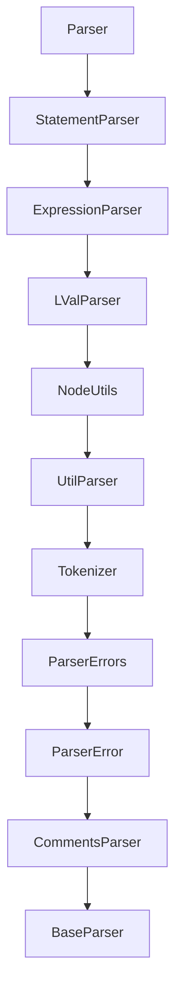

## src/parser/index.js: Parser Class
The class `Parser` is declared in the file [src/parser/index.js](https://github.com/ULL-ESIT-PL/babel-tanhauhau/blob/master/packages/babel-parser/src/parser/index.js).

Babel.js is written in [Flow](https://flow.org/en/docs/getting-started/). This choice allows the Babel team to leverage Flow's type-checking capabilities while maintaining a JavaScript codebase. However, Babel remains highly compatible with TypeScript through its plugins and is a popular tool for TypeScript users.

Here are the first lines in the file.
The `// @flow` initial comment indicates that the file is being type-checked by Flow, and the type annotations specify the expected types.

```ts
// @flow

import type { Options } from "../options";
import type { File } from "../types";
import type { PluginList } from "../plugin-utils";
``` 
It starts by importing types:

- the `Options` type, 
- the `File` type, and 
- the `PluginList` type 

from the 

- [src/options.js](https://github.com/ULL-ESIT-PL/babel-tanhauhau/blob/master/packages/babel-parser/src/options.js), (parser options like `sourceType`, `strictMode` or `tokens`)
- [src/types.js](https://github.com/ULL-ESIT-PL/babel-tanhauhau/blob/master/packages/babel-parser/src/types.js).  It defines the types of nodes like `Nodebase`, `Node`, `Expression`, `Declaration`, `Literal`,  `StringLiteral`, `Program`, `Comment`, `Token`, etc. The type `File` corresponds to the root of the AST and is defined as follows:
  
  ```ts
  export type File = NodeBase & { // & is the intersection type
    type: "File",
    program: Program,
    comments: $ReadOnlyArray<Comment>,
    tokens: $ReadOnlyArray<Token | Comment>,
  };
  ```
  [$ReadOnlyArray](https://flow.org/en/docs/types/arrays/#toc-readonlyarray) is the way to say in Flow that is a read-only array. The equivalent in TypeScript is [ReadOnlyArray](https://www.typescriptlang.org/docs/handbook/release-notes/typescript-3-4.html#a-new-syntax-for-readonlyarray).  
- [src/plugin-utils.js](https://github.com/ULL-ESIT-PL/babel-tanhauhau/blob/master/packages/babel-parser/src/plugin-utils.js) (the type `Plugin` can be a string or a tuple of a string and an object. `PluginList` is a read-only array of Plugin elements).

modules.


The file [src/parser/index.js](https://github.com/ULL-ESIT-PL/babel-tanhauhau/blob/master/packages/babel-parser/src/parser/index.js) continues like this:

```ts
import { getOptions } from "../options";
import StatementParser from "./statement";
import { SCOPE_PROGRAM } from "../util/scopeflags"; // const SCOPE_PROGRAM = 0b00000001
import ScopeHandler from "../util/scope";
import ClassScopeHandler from "../util/class-scope";
import ProductionParameterHandler, { PARAM_AWAIT, PARAM, } from "../util/production-parameter";

export type PluginsMap = Map<string, { [string]: any }>;

export default class Parser extends StatementParser { ... } 
```
It imports the class `StatementParser` which implements the `Statement` parsing. Such class is defined 
in the file [src/parser/statement.js](https://github.com/ULL-ESIT-PL/babel-tanhauhau/blob/master/packages/babel-parser/src/parser/statement.js)

The `ScopeHandler` is imported in the [babel-parser/src/parser/index.js](https://github.com/ULL-ESIT-PL/babel-tanhauhau/blob/master/packages/babel-parser/src/parser/index.js#L9-L10) module from 
[src/util/scope](https://github.com/ULL-ESIT-PL/babel-tanhauhau/blob/master/packages/babel-parser/src/util/scope.js) 

The  `ClassScopeHandler` class is imported by the `Parser` class in the 
[babel-parser/src/parser/index.js](https://github.com/ULL-ESIT-PL/babel-tanhauhau/blob/master/packages/babel-parser/src/parser/index.js#L9-L10) module from [src/util/class-scope](https://github.com/ULL-ESIT-PL/babel-tanhauhau/blob/master/packages/babel-parser/src/util/class-scope.js)


The class `Parser` extends `StatementParser` and 
has the `constructor`, the `getScopeHandler` method, and the `parse` method. 
The `pluginsMap` function is used to create a map of plugins from a list of plugins.

```ts
export default class Parser extends StatementParser {
  constructor(options: ?Options, input: string) { ... }

  getScopeHandler(): Class<ScopeHandler<*>> { return ScopeHandler; }

  parse(): File { ... }
}

function pluginsMap(plugins: PluginList): PluginsMap {
  const pluginMap: PluginsMap = new Map();
  for (const plugin of plugins) {
    const [name, options] = Array.isArray(plugin) ? plugin : [plugin, {}];
    if (!pluginMap.has(name)) pluginMap.set(name, options || {});
  }
  return pluginMap;
}
```

In the following sections, we will describe the `Parser` class and its methods.

### Constructor of the `Parser` class

The constructor of the `Parser` class is defined as follows:

```ts
  constructor(options: ?Options, input: string) {
    options = getOptions(options);
    super(options, input);

    const ScopeHandler = this.getScopeHandler();

    this.options = options;
    this.inModule = this.options.sourceType === "module";
    this.scope = new ScopeHandler(this.raise.bind(this), this.inModule);
    this.prodParam = new ProductionParameterHandler();
    this.classScope = new ClassScopeHandler(this.raise.bind(this));
    this.plugins = pluginsMap(this.options.plugins);
    this.filename = options.sourceFilename;
  }
```

### The inheritance hierarchy

The class inherits from `StatementParser`  which itself inherits from `ExpressionParser` which inherits from `BaseParser`.

```ts
export default class StatementParser extends ExpressionParser { ... }
```

```ts
export default class ExpressionParser extends LValParser { ... }
```

`src/parser/lval.js`
```ts
export default class LValParser extends NodeUtils { ... }
```

`src/parser/node.js`
```ts
export class NodeUtils extends UtilParser { ... }
```

`src/parser/util.js`
```ts
export default class UtilParser extends Tokenizer { ... }
```

```ts
export default class Tokenizer extends ParserErrors {

  isLookahead: boolean;

  // Token store.
  tokens: Array<Token | N.Comment> = [];

  constructor(options: Options, input: string) {
    super();
    this.state = new State();
    this.state.init(options);
    this.input = input;
    this.length = input.length;
    this.isLookahead = false;
  }
  ...
}
```
We can see that `Parser` objects have a `state` object  contain among other things information from the `options`. They also have properties containing the `input` string and the `length` of the input string.

`src/parser/error.js`
```ts
export default class ParserError extends CommentsParser { ... }
```

`src/parser/comments.js`
```ts
export default class CommentsParser extends BaseParser {
```

And at last we reach the `BaseParser` class:

`src/parser/base.js`
```ts
export default class BaseParser {
  // Properties set by constructor in index.js
  options: Options;
  inModule: boolean;
  scope: ScopeHandler<*>; // In Flow, the * symbol is used to indicate a generic type that Flow itself should infer,
  classScope: ClassScopeHandler;
  prodParam: ProductionParameterHandler;
  plugins: PluginsMap;
  filename: ?string;
  sawUnambiguousESM: boolean = false;
  ambiguousScriptDifferentAst: boolean = false;

  // Initialized by Tokenizer
  state: State;
  // input and length are not in state as they are constant and we do
  // not want to ever copy them, which happens if state gets cloned
  input: string;
  length: number;

  hasPlugin(name: string): boolean {
    return this.plugins.has(name);
  }

  getPluginOption(plugin: string, name: string) {
    // $FlowIssue
    if (this.hasPlugin(plugin)) return this.plugins.get(plugin)[name];
  }
```



### `parse` method

The call `this.scope.enter(SCOPE_PROGRAM)` enters the program scope.

The call to `this.parseTopLevel(file, program);`  starts the parsing at the top level.

```ts
  parse(): File {
    let paramFlags = PARAM;
    if (this.hasPlugin("topLevelAwait") && this.inModule) {
      paramFlags |= PARAM_AWAIT;
    }
    this.scope.enter(SCOPE_PROGRAM); 
    this.prodParam.enter(paramFlags);
    const file = this.startNode();
    const program = this.startNode();
    this.nextToken();
    file.errors = null;
    this.parseTopLevel(file, program);
    file.errors = this.state.errors;
    return file;
  }
}
```

Since the `Parser` class extends the `StatementParser` class, it inherits all the methods of the `StatementParser` class and thus it has access to the `parseTopLevel` method.

## The Class StatementParser and the parseTopLevel function

The class `StatementParser` implements the `Statement` parsing. It is defined 
in the file [src/parser/statement.js](https://github.com/ULL-ESIT-PL/babel-tanhauhau/blob/master/packages/babel-parser/src/parser/statement.js)

The function [parseTopLevel](https://github.com/ULL-ESIT-PL/babel-tanhauhau/blob/master/packages/babel-parser/src/parser/statement.js#L50) parses a `program`. 
It receives a `file` node and a `program` node as parameters.
The `program` parameter is a `N.Program` node that is going to represent 
the top-level structure of the program. 
It will contain the interpreter directive (if any) and the body AST of the program.
The function returns a `file` node that contains the `program` node, the `comments` 
and optionally the `tokens` of the program. Here is the [definition of the Program node](https://github.com/babel/babel/blob/master/packages/babel-parser/ast/spec.md#programs):

```ts 
Program <: Node {
  type: "Program";
  interpreter: InterpreterDirective | null; // #!/usr/bin/env node
  sourceType: "script" | "module";
  body: [ Statement | ModuleDeclaration ];  // Array of expressions or statements or import or export declarations
  directives: [ Directive ]; // "use strict" directives
}
```
This is the code of the `parseTopLevel` function:
```ts
export default class StatementParser extends ExpressionParser {

  parseTopLevel(file: N.File, program: N.Program): N.File {
    program.sourceType = this.options.sourceType;

    program.interpreter = this.parseInterpreterDirective();

    this.parseBlockBody(program, true, true, tt.eof);

    if ( // check for undefined exports if it is a module
      this.inModule &&
      !this.options.allowUndeclaredExports &&
      this.scope.undefinedExports.size > 0
    ) { // raise an error if there are undefined exports
      for (const [name] of Array.from(this.scope.undefinedExports)) {
        const pos = this.scope.undefinedExports.get(name);
        // $FlowIssue
        this.raise(pos, Errors.ModuleExportUndefined, name);
      }
    }

    file.program = this.finishNode(program, "Program");
    file.comments = this.state.comments;

    if (this.options.tokens) file.tokens = this.tokens;

    return this.finishNode(file, "File");
  }
  ...
} // End of class StatementParser
```
The assignment `program.interpreter = this.parseInterpreterDirective();` parses the 
[InterpreterDirective](https://tc39.es/ecma262/#sec-ecmascript-language-directives-and-prologues) `/#!.*/` if any.

The call `this.parseBlockBody(program, true, true, tt.eof);` parses the body of the program. 
- The first argument is the node to which the body will be attached.
- The first `true` argument `allowDirectives` indicates that directives are allowed in the body. 
  Directives are special instructions or statements that are processed differently by the JavaScript engine compared to regular code,
  like `"use strict"` and `use asm`. 
- The second `true` argument indicates that the body is top level. 
- The third argument `tt.eof` is the token type tha signals the end of the body.

### Scope Analysis

See section [babel-scope.md](babel-scope.md)

### Checking for undefined exports if it is a module

In the section:

```ts
 if ( // check for undefined exports if it is a module
      this.inModule && !this.options.allowUndeclaredExports && this.scope.undefinedExports.size > 0
    ) { // raise an error if there are undefined exports
      for (const [name] of Array.from(this.scope.undefinedExports)) {
        const pos = this.scope.undefinedExports.get(name);
        // $FlowIssue
        this.raise(pos, Errors.ModuleExportUndefined, name);
      }
    }
```

We check if we are in a module and if there are `undefined` exports.
This ensures that exports are always defined before exporting them.
This is required according to the spec here: https://www.ecma-international.org/ecma-262/9.0/index.html#sec-module-semantics-static-semantics-early-errors. See [pull request 9589](https://github.com/babel/babel/pull/9589).

The `[name]` part in the expression `for (const [name] of Array.from(this.scope.undefinedExports))` uses array destructuring to extract the first element of each iterable element in `this.scope.undefinedExports`. 

### finishNode and finishNodeAt

The `finishNode` function is responsible for finishing the construction of an AST node, assigning it final properties before it is considered complete. The function accepts a *generic* `node T`, which must be a node type (`NodeType`), along with a `type` that indicates the type of node to end, 

```ts
finishNode<T: NodeType>(node: T, type: string): T {
  return this.finishNodeAt(node, type, this.state.lastTokEnd, this.state.lastTokEndLoc);
}
```

The helper function `finishNodeAt` is responsible for the actual finishing. The function accepts a *generic* `node T`, which must be a node type (`NodeType`), along with 
- a `type` that indicates the type of node to end, 
- a `pos` position that represents the end of the node in the source code, and 
- a `loc` object which contains location information, specifically the end of the node location.

The first step within the function is a safety check for `production` that raises an error if an attempt is made to terminate a node that has already been terminated previously, which is indicated by `node.end > 0`. 

```js
  finishNodeAt<T: NodeType>(node: T, type: string, pos: number, loc: Position, ): T {
    if (process.env.NODE_ENV !== "production" && node.end > 0) {
      throw new Error(
        "Do not call finishNode*() twice on the same node." +
          " Instead use resetEndLocation() or change type directly.",
      );
    }
    node.type = type;
    node.end = pos;
    node.loc.end = loc;
    if (this.options.ranges) node.range[1] = pos;
    this.processComment(node);
    return node;
  }
  ```


### parseBlockBody

Here is the `parseBlockBody` function that is called by `parseTopLevel`:

```js
parseBlockBody(
    node: N.BlockStatementLike,
    allowDirectives: ?boolean, topLevel: boolean, end: TokenType,
    afterBlockParse?: (hasStrictModeDirective: boolean) => void,
  ): void {
    const body = (node.body = []);
    const directives = (node.directives = []);
    this.parseBlockOrModuleBlockBody(
      body,
      allowDirectives ? directives : undefined,
      topLevel,
      end,
      afterBlockParse,
    );
}
```

### parseIfStatement

The structure of all the `parse`Something functions is similar. They start by calling `this.next()` to move to the next token, then they
continue following the grammar rules using the token if needed. Finally, they call `this.finishNode` to create the AST node.
Here it the case of the `parseIfStatement` function that follows the [IfStatement](https://tc39.es/ecma262/#sec-if-statement-static-semantics-early-errors) grammar rule:

```js
  parseIfStatement(node: N.IfStatement): N.IfStatement {
    this.next(); // eat `if`
    node.test = this.parseHeaderExpression();    // parse the test expression
    node.consequent = this.parseStatement("if"); // parse the consequent statement
    node.alternate = this.eat(tt._else) ? this.parseStatement("if") : null; // eat `else` and parse the alternate statement if any
    return this.finishNode(node, "IfStatement");
  }
```

### Methods consuming tokens

We can see the difference between `this.eat(tt._else)` and `this.next()`. The former consumes the token if it is an `else` token, while the latter just moves to the next token without consuming it. There is also `this.expect(tt._else)` that raises an error if the next token is not an `else` token and consumes it if it is:

```js
  expect(type: TokenType, pos?: ?number): void {
    this.eat(type) || this.unexpected(pos, type);
  }
  ```
Another method is `this.match` that returns `true` if the next token is of the given type without consuming it:

```js
  match(type: TokenType): boolean {
    return this.state.type === type;
  }
```
